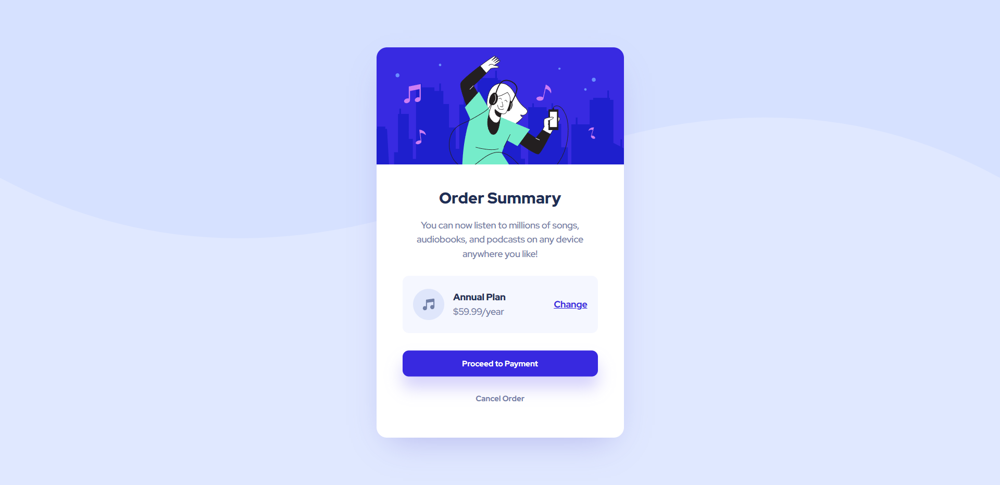
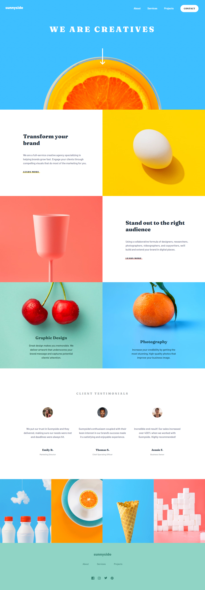
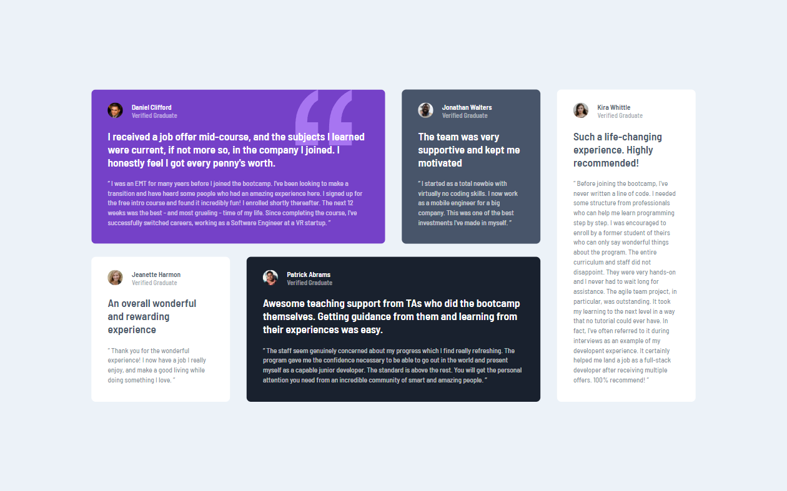
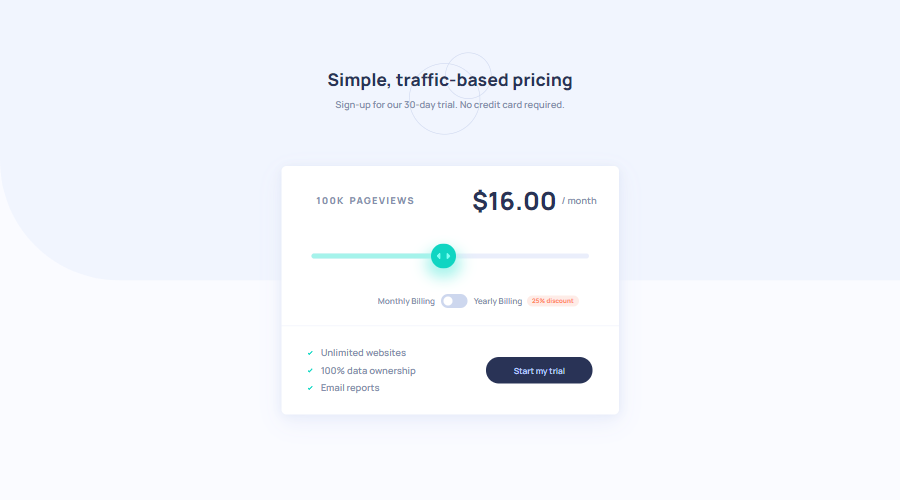

# 🎯 Frontend Mentor Challenges

These are my solutions to the challenges I've completed on [Frontend Mentor](https://www.frontendmentor.io/).

#### ✅ Link to the website: [https://anushkachauhxn.github.io/frontend-mentor-projects](https://anushkachauhxn.github.io/frontend-mentor-projects)

 

## 💡 Projects Completed

### 1. Order Summary Component

- 📝 GitHub Repository: [Link](https://github.com/anushkachauhxn/frontend-mentor-projects/tree/main/projects/1-order-summary-component)
- 🕸️ Live Site: [Link](https://anushkachauhxn.github.io/frontend-mentor-projects/projects/1-order-summary-component/)

  

### 2. FAQ Accordion Card

- 📝 GitHub Repository: [Link](https://github.com/anushkachauhxn/frontend-mentor-projects/tree/main/projects/2-faq-accordion-card)
- 🕸️ Live Site: [Link](https://anushkachauhxn.github.io/frontend-mentor-projects/projects/2-faq-accordion-card/)

  

### 3. Sunnyside Agency Landing Page

- 📝 GitHub Repository: [Link](https://github.com/anushkachauhxn/frontend-mentor-projects/tree/main/projects/3-sunnyside-agency-landing-page)
- 🕸️ Live Site: [Link](https://anushkachauhxn.github.io/frontend-mentor-projects/projects/3-sunnyside-agency-landing-page/)

  

### 4. Pricing Component with Toggle Master

- 📝 GitHub Repository: [Link](https://github.com/anushkachauhxn/frontend-mentor-projects/tree/main/projects/4-pricing-component-with-toggle-master)
- 🕸️ Live Site: [Link](https://anushkachauhxn.github.io/frontend-mentor-projects/projects/4-pricing-component-with-toggle-master/)

  

### 5. Testimonials Grid Section

- 📝 GitHub Repository: [Link](https://github.com/anushkachauhxn/frontend-mentor-projects/tree/main/projects/5-testimonials-grid-section)
- 🕸️ Live Site: [Link](https://anushkachauhxn.github.io/frontend-mentor-projects/projects/5-testimonials-grid-section/)

  

### 6. Interactive Pricing Component

- 📝 GitHub Repository: [Link](https://github.com/anushkachauhxn/frontend-mentor-projects/tree/main/projects/6-interactive-pricing-component)
- 🕸️ Live Site: [Link](https://anushkachauhxn.github.io/frontend-mentor-projects/projects/6-interactive-pricing-component/)

  

## ⭐ Author

-  
  <strong> GitHub </strong>
  <a href="https://github.com/anushkachauhxn">@anushkachauhxn</a>
- 
  <strong> Behance </strong>
  <a href="https://www.behance.net/anushka_creates">@anushka_creates</a>

-  
  <strong> LinkedIn </strong>
  <a href="https://www.linkedin.com/in/anushka-chauhan">@anushka-chauhan</a>
-  
  <strong> Twitter </strong>
  <a href="https://twitter.com/anushka_creates">@anushka_creates</a>
