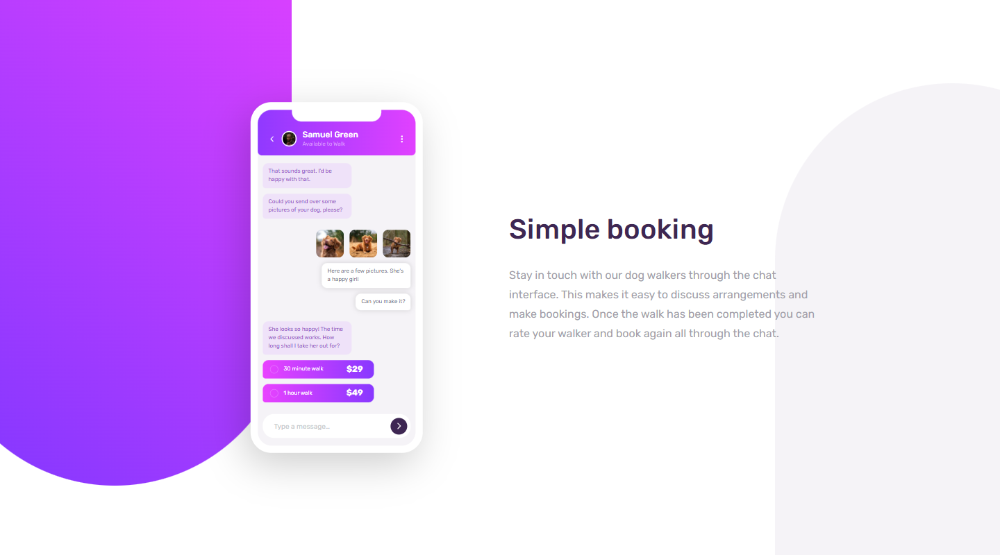
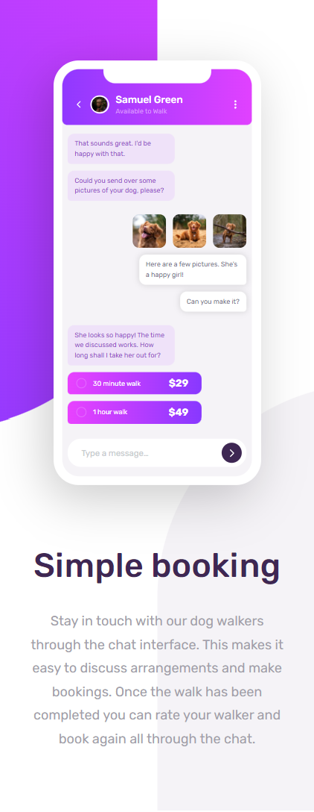

# 🎯 Frontend Mentor - Shortly URL Shortening API Challenge

This is a solution to the [Chat app CSS illustration challenge on Frontend Mentor](https://www.frontendmentor.io/challenges/chat-app-css-illustration-O5auMkFqY). Frontend Mentor challenges help you improve your coding skills by building realistic projects.

## 📜 Table of contents

- [Overview](#overview)
  - [The challenge](#the-challenge)
  - [Screenshot](#screenshot)
  - [Links](#links)
- [My process](#my-process)
  - [Built with](#built-with)
  - [What I learned](#what-i-learned)
- [Author](#author)

## 📝 Overview

### The challenge

- Users should be able to:
  - View the optimal layout for the component depending on their device's screen size
  - **Bonus**: See the chat interface animate on the initial load

### Screenshot

### Links

- Solution URL: [Link](https://github.com/anushkachauhxn/frontend-mentor-projects/tree/main/projects/10-chat-app-css-illustration)
- Live Site URL: [Link](https://anushkachauhxn.github.io/frontend-mentor-projects/projects/10-chat-app-css-illustration/)

## 💡 My process

### Built with

- Semantic HTML5 markup
- CSS custom properties
- Flexbox

### What I learned

Before jumping straight to the CSS, plan the HTML in the most optimised and efficient way.

#### HTML

- main
  - text
  - illustration
    - 👩‍🦰 profile
    - 📱 chat-messages
      - ➡️ incoming
        - ✏️ chat-msg text-msg
        - ✏️ chat-msg text-msg
      - ⬅️ outgoing
        - 🖼️ chat-msg img-msg
        - ✏️ chat-msg text-msg
        - ✏️ chat-msg text-msg
      - ➡️ incoming
        - ✏️ chat-msg text-msg
        - 💵 chat-msg price-msg
        - 💵 chat-msg price-msg
    - ⌨️ chatbox

#### Description

- I divided **illustration** into _profile_, _chat-messages_ and _chatbox_ so that:

  - I could use `absolute` positioning for profile and chatbox at the top and bottom and then style chat-messages in the middle.

- I divided the **chat-messages** into blocks of _incoming_ and _outgoing_ so that:

  - I could use the `row-gap` property of flexbox.
    - By observing the image provided, you see that the space between blobs of incoming and outgoing messages is greater than that between individual chat messages.
  - I could use the `align-items` property to align them on the screen.

- Inside **incoming** and **outgoing**, I added the individual messages. I gave them classes `text-msg`, `img-msg` and `price-msg` so that I could style them according to their content.

## ⭐ Author

- GitHub - [@anushkachauhxn](https://github.com/anushkachauhxn)
- Behance - [@anushka_creates](https://www.behance.net/anushka_creates)

- LinkedIn - [@anushka-chauhan](https://www.linkedin.com/in/anushka-chauhan)
- Twitter - [@anushka_creates](https://twitter.com/anushka_creates)
