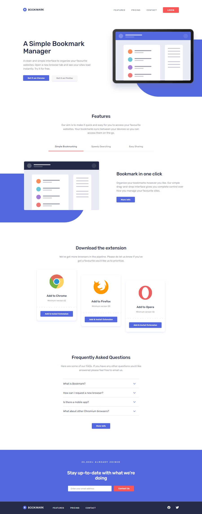

# 🎯 Frontend Mentor - Bookmark Landing Page Challenge

This is a solution to the [Bookmark landing page challenge on Frontend Mentor](https://www.frontendmentor.io/challenges/bookmark-landing-page-5d0b588a9edda32581d29158). Frontend Mentor challenges help you improve your coding skills by building realistic projects.

## 📜 Table of contents

- [Overview](#overview)
  - [The challenge](#the-challenge)
  - [Screenshot](#screenshot)
  - [Links](#links)
- [My process](#my-process)
  - [Built with](#built-with)
  - [What I learned](#what-i-learned)
  - [Useful resources](#useful-resources)
- [Author](#author)

## 📝 Overview

### The challenge

- Your challenge is to build out this landing page and get it looking as close to the design as possible.
- Your users should be able to:
  - View the optimal layout for the site depending on their device's screen size
  - See hover states for all interactive elements on the page
  - Receive an _error message_ when the newsletter form is submitted if:
    - The input field is empty
    - The email address is not formatted correctly
- For this challenge you'll need to:
  - Create the rounded blue background shape with code
  - Change the `fill` and `stroke` color of the SVGs at specific points (the challenge can be completed using the single `logo-bookmark.svg` file provided)

### Screenshot

### Links

- Solution URL: [Link](https://github.com/anushkachauhxn/frontend-mentor-projects/tree/main/projects/12-bookmark-landing-page)
- Live Site URL: [Link](https://anushkachauhxn.github.io/frontend-mentor-projects/projects/12-bookmark-landing-page/)

## 💡 My process

### 🏗️ Built with

- Semantic HTML5 markup
- CSS custom properties
- Flexbox
- Vanilla JS

### 🤓 What I learned

- Properly sectioning the complete webpage makes it easier to tackle.

- I divided the whole design into _header_, _main_ and _footer_. Then divided main and footer into different sections. This gave me a clear sight of what needed to be done and the amount of progress I had made.

- Proper naming of all sections, divs and even buttons helps make the styling very easy.

- While styling the webpage, I noticed patterns in the sections and took advantage of them by using classes like `cta-btn` and styling common elements in the beginning like `heading tags`, `ul`, `a`, `button`, etc.

### 🔎 Useful resources

- [How TO - Collapsibles/Accordion](https://www.w3schools.com/howto/howto_js_accordion.asp)

- [How TO - Tabs](https://www.w3schools.com/howto/howto_js_tabs.asp)

- [What's the best way to validate an email address in JavaScript?](https://stackoverflow.com/a/46181/12302691)

## ⭐ Author

- GitHub - [@anushkachauhxn](https://github.com/anushkachauhxn)
- Behance - [@anushka_creates](https://www.behance.net/anushka_creates)

- LinkedIn - [@anushka-chauhan](https://www.linkedin.com/in/anushka-chauhan)
- Twitter - [@anushka_creates](https://twitter.com/anushka_creates)
