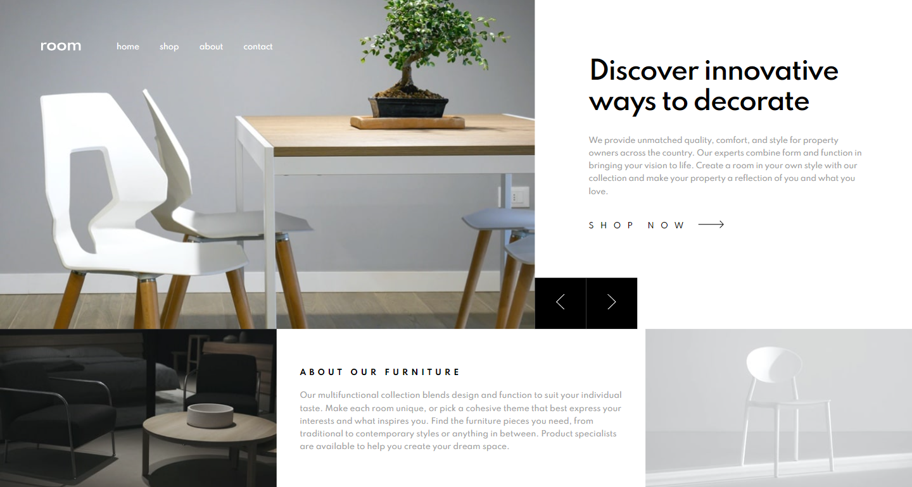

# 🎯 Frontend Mentor - Room Homepage Challenge

This is a solution to the [Room homepage challenge on Frontend Mentor](https://www.frontendmentor.io/challenges/room-homepage-BtdBY_ENq). Frontend Mentor challenges help you improve your coding skills by building realistic projects.

## 📜 Table of contents

- [Overview](#overview)
  - [The challenge](#the-challenge)
  - [Screenshot](#screenshot)
  - [Links](#links)
- [My process](#my-process)
  - [Built with](#built-with)
  - [What I learned](#what-i-learned)
  - [Useful resources](#useful-resources)
- [Author](#author)

## 📝 Overview

### The challenge

- Your challenge is to build out this e-commerce homepage and get it looking as close to the design as possible.
- Your users should be able to:
  - View the optimal layout for the site depending on their device's screen size
  - See hover states for all interactive elements on the page
  - Navigate the slider using either their mouse/trackpad

### Screenshot



### Links

- Solution URL: [Link](https://github.com/anushkachauhxn/frontend-mentor-projects/tree/main/projects/13-room-homepage)
- Live Site URL: [Link](https://anushkachauhxn.github.io/frontend-mentor-projects/projects/13-room-homepage/)

## 💡 My process

### 🏗️ Built with

- Semantic HTML5 markup
- CSS custom properties
- Flexbox
- Vanilla JS

### What I learned

#### 😎 Proud of this JS

```js
var currSlide = 0,
  prevSlide = 2,
  nextSlide = 1;

prevBtn.onclick = function () {
  removeActives(imgSlides);
  addActive(imgSlides[prevSlide]);
  removeActives(textSlides);
  addActive(textSlides[prevSlide]);

  currSlide = prevSlide;
  updatePrev(currSlide);
  updateNext(currSlide);
};

nextBtn.onclick = function () {
  removeActives(imgSlides);
  addActive(imgSlides[nextSlide]);
  removeActives(textSlides);
  addActive(textSlides[nextSlide]);

  currSlide = nextSlide;
  updatePrev(currSlide);
  updateNext(currSlide);
};

/* Slide Update Functions */
function updatePrev(currSlide) {
  if (currSlide === 0) {
    prevSlide = 2;
  } else {
    prevSlide = currSlide - 1;
  }
}
function updateNext(currSlide) {
  if (currSlide === 2) {
    nextSlide = 0;
  } else {
    nextSlide = currSlide + 1;
  }
}

/* Active Class Functions */
function addActive(element) {
  element.classList.add("active");
}
function removeActive(element) {
  element.classList.remove("active");
}
function removeActives(elements) {
  elements.forEach((element) => {
    element.classList.remove("active");
  });
}
```

### 🔎 Useful resources

- [CSS filter generator to convert from black to target hex color](https://codepen.io/sosuke/pen/Pjoqqp)

- [Fading Animation Example](https://www.w3schools.com/howto/howto_js_slideshow.asp)

## ⭐ Author

- GitHub - [@anushkachauhxn](https://github.com/anushkachauhxn)
- Behance - [@anushka_creates](https://www.behance.net/anushka_creates)

- LinkedIn - [@anushka-chauhan](https://www.linkedin.com/in/anushka-chauhan)
- Twitter - [@anushka_creates](https://twitter.com/anushka_creates)
