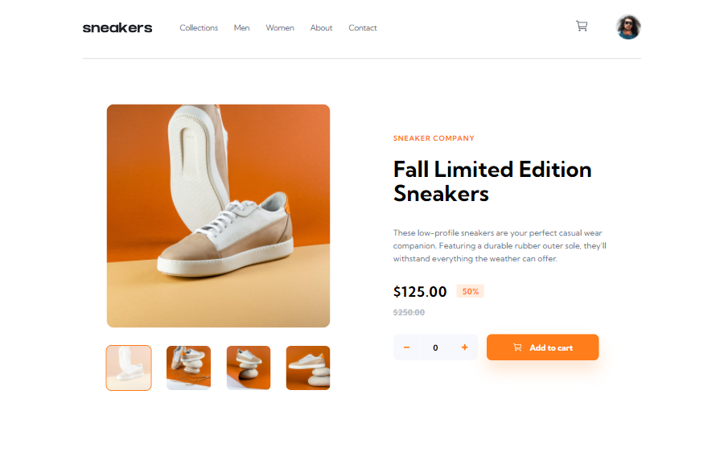

# 🎯 Frontend Mentor - E-commerce Product Page Challenge

This is a solution to the [E-commerce product page challenge on Frontend Mentor](https://www.frontendmentor.io/challenges/ecommerce-product-page-UPsZ9MJp6). Frontend Mentor challenges help you improve your coding skills by building realistic projects.

## 📜 Table of contents

- [Overview](#overview)
  - [The challenge](#the-challenge)
  - [Screenshot](#screenshot)
  - [Links](#links)
- [My process](#my-process)
  - [Built with](#built-with)
  - [What I learned](#what-i-learned)
- [Author](#author)

## 📝 Overview

### The challenge

- Your challenge is to build out this e-commerce product page and get it looking as close to the design as possible.

- Your users should be able to:
  - View the optimal layout for the site depending on their device's screen size
  - See hover states for all interactive elements on the page
  - Open a lightbox gallery by clicking on the large product image
  - Switch the large product image by clicking on the small thumbnail images
  - Add items to the cart
  - View the cart and remove items from it

### Screenshot



### Links

- Solution URL: [Link](https://github.com/anushkachauhxn/frontend-mentor-projects/tree/main/projects/14-ecommerce-product-page)
- Live Site URL: [Link](https://anushkachauhxn.github.io/frontend-mentor-projects/projects/14-ecommerce-product-page/)

## 💡 My process

### 🏗️ Built with

- Semantic HTML5 markup
- CSS custom properties
- Flexbox
- Vanilla JS

### What I learned

#### 😎 Proud of this JS

```js
var numOfItems = 0;

plusBtn.onclick = () => {
  numOfItems++;
  updateItems(numOfItems);
};
minusBtn.onclick = () => {
  if (numOfItems > 0) {
    numOfItems--;
    updateItems(numOfItems);
  }
};
deleteBtn.onclick = () => {
  numOfItems = 0;
  updateItems(numOfItems);
};

/* Update Items on the Input Box */
function updateItems(numOfItems) {
  itemsBox.value = numOfItems;
  updatePopup(numOfItems);
  updatePrice(numOfItems);

  if (numOfItems === 0) {
    addEmpty(cart);
    addEmpty(itemsPopup);
  } else {
    removeEmpty(cart);
    removeEmpty(itemsPopup);
  }
}
/* Update Price in the Cart Checkout */
function updatePrice(numOfItems) {
  const newPrice = (numOfItems * 125).toFixed(2);
  checkoutPrice.innerHTML = `$125.00 x ${numOfItems} <span>$${newPrice}</span>`;
}
/* Update orange popup on cart icon */
function updatePopup(numOfItems) {
  itemsPopup.innerHTML = numOfItems;
}
```

## ⭐ Author

- GitHub - [@anushkachauhxn](https://github.com/anushkachauhxn)
- Behance - [@anushka_creates](https://www.behance.net/anushka_creates)

- LinkedIn - [@anushka-chauhan](https://www.linkedin.com/in/anushka-chauhan)
- Twitter - [@anushka_creates](https://twitter.com/anushka_creates)
