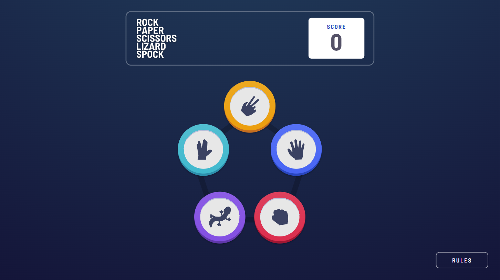
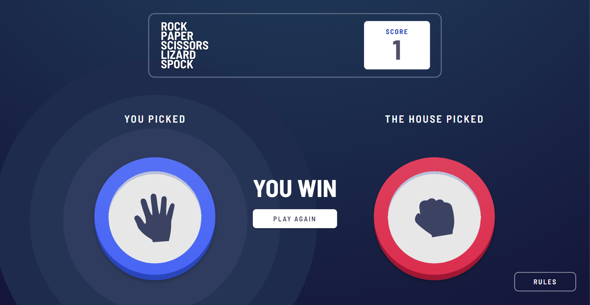

# 🎯 Frontend Mentor - Rock, Paper, Scissors, Lizard, Spock Challenge

This is a solution to the [Rock, Paper, Scissors challenge on Frontend Mentor](https://www.frontendmentor.io/challenges/rock-paper-scissors-game-pTgwgvgH). Frontend Mentor challenges help you improve your coding skills by building realistic projects.

#### ✅Link to Project: https://github.com/anushkachauhxn/fm-rock-paper-scissors-lizard-spock

## 📜 Table of contents

- [Overview](#overview)
  - [The challenge](#the-challenge)
  - [Screenshot](#screenshot)
  - [Links](#links)
- [My process](#my-process)
  - [Built with](#built-with)
  - [What I learned](#what-i-learned)
- [Useful resources](#useful-resources)
- [Author](#author)

## 📝 Overview

### The challenge

- Your challenge is to build out this Rock, Paper, Scissors game and get it looking as close to the design as possible.

- Your users should be able to:
  - ☑️ View the optimal layout for the game depending on their device's screen size
  - ☑️ Play Rock, Paper, Scissors against the computer
  - ☑️ Maintain the state of the score after refreshing the browser _(optional)_
  - ☑️ **Bonus**: Play Rock, Paper, Scissors, Lizard, Spock against the computer _(optional)_

### Screenshot




### Links

- Solution URL: [Link](https://github.com/anushkachauhxn/fm-rock-paper-scissors-lizard-spock)
- Live Site URL: [Link](https://anushkachauhxn.github.io/fm-rock-paper-scissors-lizard-spock/)

## 💡 My process

### Built with

- React JS
- React Router
- Redux
- Material UI
- CSS custom properties

### What I learned

#### 😎 Proud of this CSS:

The all CSS winner animation!

```css
/* Animation On Result */
.game__side button {
  position: relative;
}

.game__side button::before,
.game__side button::after {
  content: "";
  position: absolute;
  z-index: -1;
  border-radius: 50%;
  animation: ripple 0.75s cubic-bezier(0.65, 0, 0.34, 1) 0s 1;
}

.game__side button::before {
  height: calc(332px * 1.75);
  width: calc(332px * 1.75);
  border: 84px solid hsl(223, 44%, 21%); /* Outer Ring */
}
.game__side button::after {
  height: calc(332px * 1.28);
  width: calc(332px * 1.28);
  background: hsl(224, 33%, 28%); /* Inner Ring */
  border: 78px solid hsl(223, 39%, 24%); /* Middle Ring */
}

@keyframes ripple {
  from {
    transform: scale3d(0, 0, 1);
  }
  to {
    transform: scale3d(1, 1, 1);
  }
}
```

#### 😎 Proud of this JS:

The whole Redux store structure and the actions have to be precise. The timing for calling the functions should be well thought.

`gameSlice.js :`

```js
const winners = [
  // winners[userVal] = [compVals that make user win]
  [2, 3],
  [0, 4],
  [1, 3],
  [1, 4],
  [0, 2],
];

export const gameSlice = createSlice({
  name: "game",
  initialState: {
    userVal: null,
    compVal: -1,
    result: null,
    score: 0,
  },
  reducers: {
    setUserVal: (state, action) => {
      state.userVal = action.payload;
    },
    setCompVal: (state) => {
      let res = Math.floor(Math.random() * 5);

      for (let i = 1; res === state.userVal; i++) {
        // To avoid draws
        res = Math.floor(Math.random() * 5);
        if (i > 5) {
          alert("Something went wrong.");
          break;
        }
      }
      state.compVal = res;
    },
    calculateResult: (state) => {
      const compVals = winners[state.userVal];

      if (compVals.includes(state.compVal)) {
        state.result = 1; // user wins
      } else {
        state.result = -1; // comp wins
      }
    },
    updateScore: (state) => {
      state.score = parseInt(state.score);
      state.score += parseInt(state.result);
      if (state.score < 0) {
        state.score = 0;
      }
      sessionStorage.setItem("score", state.score);
    },
    setScore: (state) => {
      // Getting the score after page has been refreshed
      state.score = sessionStorage.getItem("score") || 0;
    },
    resetGame: (state) => {
      state.userVal = null;
      state.compVal = -1;
      state.result = null;
    },
  },
});
```

`Main.js :`

```js
const openGame = (usersPick) => {
  dispatch(setUserVal(usersPick));

  setTimeout(() => {
    dispatch(setCompVal());

    setTimeout(() => {
      dispatch(calculateResult());
      dispatch(updateScore());
    }, 500);
  }, 1000);

  history.push("/game");
};
```

## 🔎 Useful resources

#### 🧩 Stackoverflow:

- [Generate random number between two numbers in JavaScript](https://stackoverflow.com/a/24152886/12302691)

#### 📖 mdn:

- [Web Local Storage](https://developer.mozilla.org/en-US/docs/Web/API/Web_Storage_API/Using_the_Web_Storage_API)
- [Session Storage](https://developer.mozilla.org/en-US/docs/Web/API/Window/sessionStorage)

## ⭐ Author

- GitHub - [@anushkachauhxn](https://github.com/anushkachauhxn)
- Behance - [@anushka_creates](https://www.behance.net/anushka_creates)

- LinkedIn - [@anushka-chauhan](https://www.linkedin.com/in/anushka-chauhan)
- Twitter - [@anushka_creates](https://twitter.com/anushka_creates)
