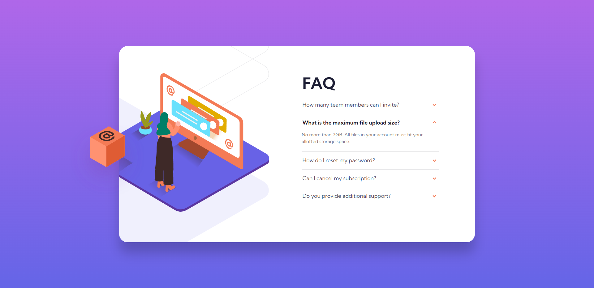

# 🎯 Frontend Mentor - FAQ Accordion Card Solution

This is a solution to the [FAQ accordion card challenge on Frontend Mentor](https://www.frontendmentor.io/challenges/faq-accordion-card-XlyjD0Oam). Frontend Mentor challenges help you improve your coding skills by building realistic projects.

## 📜 Table of contents

- [Overview](#overview)
  - [The challenge](#the-challenge)
  - [Screenshot](#screenshot)
  - [Links](#links)
- [My process](#my-process)
  - [Built with](#built-with)
  - [What I learned](#what-i-learned)
  - [Continued development](#continued-development)
- [Author](#author)

 

## 📝 Overview

### The Challenge

- Your challenge is to build out this FAQ accordion card and get it looking as close to the design as possible.

- Users should be able to:
  - View the optimal layout for the component depending on their device's screen size
  - See hover states for all interactive elements on the page
  - Hide/Show the answer to a question when the question is clicked
  - Bonus: Complete the challenge without using JavaScript (_Completed!_)

### Screenshot

### Links

- Solution URL: [Link](https://github.com/anushkachauhxn/frontend-mentor-projects/tree/main/projects/2-faq-accordion-card)
- Live Site URL: [Link](https://anushkachauhxn.github.io/frontend-mentor-projects/projects/2-faq-accordion-card/)

## 💡 My process

### Built with

- Semantic HTML5 markup
- CSS custom properties
- Flexbox
- Bootstrap Framework

### What I learned

I used Bootstrap for the accordion open and close feature. I learnt how to read the documentation and take what parts you need and leave the extra. This was very valuable as I did not want the Bootstrap CSS in the card, but only the collapse functionality.

### Continued development

I want to continue learning and getting better at CSS Application. I'm more comfortable with simple CSS and vanilla JS. So I want to practice using frameworks like React, Material UI etc.

## ⭐ Author

- GitHub - [@anushkachauhxn](https://github.com/anushkachauhxn)
- Behance - [@anushka_creates](https://www.behance.net/anushka_creates)

- LinkedIn - [@anushka-chauhan](https://www.linkedin.com/in/anushka-chauhan)
- Twitter - [@anushka_creates](https://twitter.com/anushka_creates)
