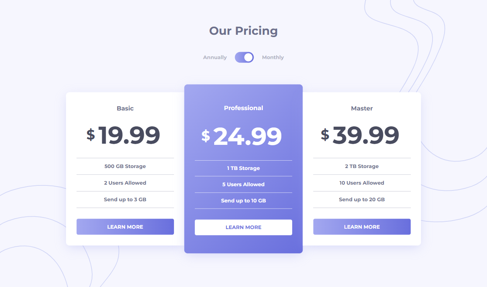

# 🎯 Frontend Mentor - Pricing Component with Toggle Solution

This is a solution to the [Pricing component with toggle challenge on Frontend Mentor](https://www.frontendmentor.io/challenges/pricing-component-with-toggle-8vPwRMIC). Frontend Mentor challenges help you improve your coding skills by building realistic projects.

## 📜 Table of contents

- [Overview](#overview)
  - [The challenge](#the-challenge)
  - [Screenshot](#screenshot)
  - [Links](#links)
- [My process](#my-process)
  - [Built with](#built-with)
  - [What I learned](#what-i-learned)
  - [Continued development](#continued-development)
  - [Useful resources](#useful-resources)
- [Author](#author)

 

## 📝 Overview

### The Challenge

- Your challenge is to build out this pricing component and get it looking as close to the design as possible.
- Your users should be able to:
  - View the optimal layout for the component depending on their device's screen size
  - Control the toggle with both their mouse/trackpad and their keyboard
  - See hover states for interactive elements

### Screenshot

### Links

- Solution URL: [Link](https://github.com/anushkachauhxn/frontend-mentor-projects/tree/main/projects/4-pricing-component-with-toggle-master)
- Live Site URL: [Link](https://anushkachauhxn.github.io/frontend-mentor-projects/projects/4-pricing-component-with-toggle-master/)

## 💡 My process

### Built with

- Semantic HTML5 markup
- CSS custom properties
- Flexbox

### What I learned

This project helped me write clean code. The same result can be achieved in a lot of ways. My code solution is clean and does not have any unnecessary divs or css lines that don't make a difference in the layout.

### Useful resources

- [How To Create a Toggle Switch](https://www.w3schools.com/howto/howto_css_switch.asp) - This helped me with the toggle switch between annual and monthly pricing plans.
- [Stackoverflow 1](https://stackoverflow.com/a/9887395) - This stackoverflow answer helped me with the toggle switch Javascript.
- [Stackoverflow 2](https://stackoverflow.com/a/69479376) - This stackoverflow answer helped me with an error in Javascript.

## ⭐ Author

- GitHub - [@anushkachauhxn](https://github.com/anushkachauhxn)
- Behance - [@anushka_creates](https://www.behance.net/anushka_creates)

- LinkedIn - [@anushka-chauhan](https://www.linkedin.com/in/anushka-chauhan)
- Twitter - [@anushka_creates](https://twitter.com/anushka_creates)
