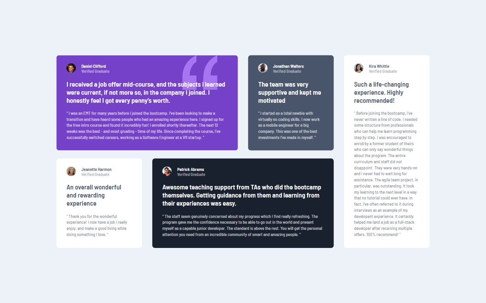

# 🎯 Frontend Mentor - Testimonials Grid Section Solution

This is a solution to the [Testimonials Grid Section Challenge on Frontend Mentor](https://www.frontendmentor.io/challenges/testimonials-grid-section-Nnw6J7Un7). Frontend Mentor challenges help you improve your coding skills by building realistic projects.

## 📜 Table of contents

- [Overview](#overview)
  - [The challenge](#the-challenge)
  - [Screenshot](#screenshot)
  - [Links](#links)
- [My process](#my-process)
  - [Built with](#built-with)
  - [What I learned](#what-i-learned)
  - [Continued development](#continued-development)
  - [Useful resources](#useful-resources)
- [Author](#author)

## 📝 Overview

### The challenge

- Your challenge is to build out this testimonials grid section and get it looking as close to the design as possible.
- Your users should be able to:
  - View the optimal layout for the site depending on their device's screen size

### Screenshot



### Links

- Solution URL: [Link](https://github.com/anushkachauhxn/frontend-mentor-projects/tree/main/projects/5-testimonials-grid-section)
- Live Site URL: [Link](https://anushkachauhxn.github.io/frontend-mentor-projects/projects/5-testimonials-grid-section/)

## 💡 My process

### Built with

- Semantic HTML5 markup
- CSS custom properties
- Flexbox
- CSS Grid

### What I learned

Got seriously better at using CSS Grid.

#### 😎 Proud of this CSS:

```css
.container {
  max-width: 100%;
  margin: 40px;

  display: grid;
  grid-template-columns: repeat(4, 254px);
  grid-gap: 24px 30px;
  grid-template-areas:
    "daniel daniel jonathan kira"
    "jeanette patrick patrick kira";
}
```

### Useful resources

- [Learn CSS Grid in 20 Minutes](https://www.youtube.com/watch?v=9zBsdzdE4sM) - This tutorial helped me recap everything about CSS Grid quickly.

## ⭐ Author

- GitHub - [@anushkachauhxn](https://github.com/anushkachauhxn)
- Behance - [@anushka_creates](https://www.behance.net/anushka_creates)

- LinkedIn - [@anushka-chauhan](https://www.linkedin.com/in/anushka-chauhan)
- Twitter - [@anushka_creates](https://twitter.com/anushka_creates)
