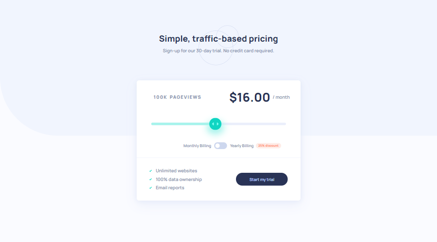

# 🎯 Frontend Mentor - Interactive Pricing Component Solution

This is a solution to the [Interactive pricing component challenge on Frontend Mentor](https://www.frontendmentor.io/challenges/interactive-pricing-component-t0m8PIyY8). Frontend Mentor challenges help you improve your coding skills by building realistic projects.

## 📜 Table of contents

- [Overview](#overview)
  - [The challenge](#the-challenge)
  - [Screenshot](#screenshot)
  - [Links](#links)
- [My process](#my-process)
  - [Built with](#built-with)
  - [What I learned](#what-i-learned)
  - [Continued development](#continued-development)
  - [Useful resources](#useful-resources)
- [Author](#author)

## 📝 Overview

### The challenge

- Your challenge is to build out this interactive pricing component and get it looking as close to the design as possible.
- Your users should be able to:
  - View the optimal layout for the app depending on their device's screen size
  - See hover states for all interactive elements on the page
  - Use the slider and toggle to see prices for different page view numbers (details provided below)

### Screenshot



### Links

- Solution URL: [Link](https://github.com/anushkachauhxn/frontend-mentor-projects/tree/main/projects/6-interactive-pricing-component)
- Live Site URL: [Link](https://anushkachauhxn.github.io/frontend-mentor-projects/projects/6-interactive-pricing-component/)

## 💡 My process

### Built with

- Semantic HTML5 markup
- CSS custom properties
- Flexbox
- CSS Grid
- Vanilla JS

### What I learned

#### 😎 Proud of this CSS:

The problem I faced while styling the Range Slider is that you cannot [select the range progress in chrome](https://stackoverflow.com/a/68294843/12302691). So instead I used two spans to display the empty slider bar and full slider bar.

```html
<section class="slider-container">
  <input
    id="rangeSlider"
    class="range-slider"
    type="range"
    min="10"
    max="200"
    value="100"
  />
  <span id="rangeSliderBg" class="range-slider-bg"></span>
  <span id="rangeSliderProgress" class="range-slider-progress"></span>
</section>
```

```css
.slider-container {
  padding: 0 48px;
  position: relative;
}

/* Empty Slider Bar */
.slider-container .range-slider-bg {
  position: absolute;
  top: 50%;
  transform: translateY(-50%);
  left: 48px;
  width: calc(100% - 2 * 48px);
  height: 8px;
  border-radius: 8px;
  background: var(--light-grayish-blue-1);
  z-index: 10;
}

/* Full Slider Bar */
.slider-container .range-slider-progress {
  position: absolute;
  top: 50%;
  transform: translateY(-50%);
  left: 48px;
  width: calc(((100% - 2 * 48px) / 2)); /* Change value using javascript */
  height: 8px;
  border-radius: 8px;
  background: var(--soft-cyan);
  z-index: 11;
}

/* Actual Input Range Slider (Transparent) */
.slider-container .range-slider {
  -webkit-appearance: none;
  appearance: none;
  outline: none;
  width: 100%;
  height: 8px;
  border-radius: 8px;
  background: transparent;
  z-index: 12;
}
```

<br>

#### 😎 Proud of this JS:

```js
// Display values
var pages = ["10K", "50K", "100K", "500K", "1M"];
var prices = ["$8.00", "$12.00", "$16.00", "$24.00", "$36.00"];
var discountedPrices = ["$6.00", "$9.00", "$12.00", "$18.00", "$27.00"];

toggleSwitchElement.oninput = function () {
  priceElement.innerHTML = toggleSwitchElement.checked
    ? discountedPrices[rangeSliderElement.value]
    : prices[rangeSliderElement.value];
};

// Slider bar value
var ratio = 0.5;
var width =
  window.innerWidth <= 375
    ? "(100% - (2 * 24px))"
    : "(100% - (2 * 48px) - 20px)";
// padding differs depending on the device width

rangeSliderElement.oninput = function () {
  pagesElement.innerHTML = pages[this.value];

  priceElement.innerHTML = toggleSwitchElement.checked
    ? discountedPrices[this.value]
    : prices[this.value];

  ratio = parseInt(this.value) / 4;
  rangeSliderProgressElement.style.width = `calc(${width} * ${ratio})`;
};
rangeSliderElement.oninput(); // for default values
```

<br>

### Useful resources

- [How To Create a Toggle Switch](https://www.w3schools.com/howto/howto_css_switch.asp)
- [Creating a Range Slider](https://www.w3schools.com/howto/howto_js_rangeslider.asp)
- [HTML input range step as an array of values](https://stackoverflow.com/a/31712438/12302691)
- [Refresh page on resize with javascript or jquery](https://stackoverflow.com/a/14915697/12302691)

## ⭐ Author

- GitHub - [@anushkachauhxn](https://github.com/anushkachauhxn)
- Behance - [@anushka_creates](https://www.behance.net/anushka_creates)

- LinkedIn - [@anushka-chauhan](https://www.linkedin.com/in/anushka-chauhan)
- Twitter - [@anushka_creates](https://twitter.com/anushka_creates)
