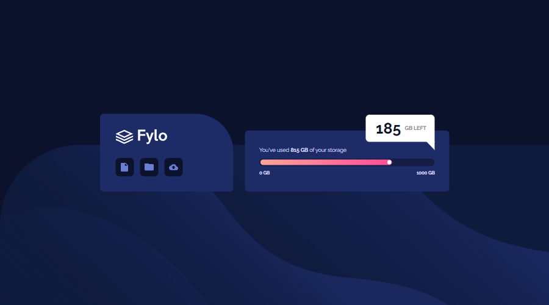

# 🎯 Frontend Mentor - Fylo Data Storage Component Solution

This is a solution to the [Fylo data storage component challenge on Frontend Mentor](https://www.frontendmentor.io/challenges/fylo-data-storage-component-1dZPRbV5n). Frontend Mentor challenges help you improve your coding skills by building realistic projects.

## 📜 Table of contents

- [Overview](#overview)
  - [The challenge](#the-challenge)
  - [Screenshot](#screenshot)
  - [Links](#links)
- [My process](#my-process)
  - [Built with](#built-with)
  - [What I learned](#what-i-learned)
- [Author](#author)

## 📝 Overview

### The challenge

- Your challenge is to build out this data storage component and get it looking as close to the design as possible.
- Users should be able to:
  - View the optimal layout for the site depending on their device's screen size

### Screenshot

### Links

- Solution URL: [Link](https://github.com/anushkachauhxn/frontend-mentor-projects/tree/main/projects/7-fylo-data-storage-component)
- Live Site URL: [Link](https://anushkachauhxn.github.io/frontend-mentor-projects/projects/7-fylo-data-storage-component/)

## 💡 My process

### Built with

- Semantic HTML5 markup
- CSS custom properties
- Flexbox

### What I learned

I got better at writing CSS that can be device independent (like using percentage instead of hard values in px).

## ⭐ Author

- GitHub - [@anushkachauhxn](https://github.com/anushkachauhxn)
- Behance - [@anushka_creates](https://www.behance.net/anushka_creates)

- LinkedIn - [@anushka-chauhan](https://www.linkedin.com/in/anushka-chauhan)
- Twitter - [@anushka_creates](https://twitter.com/anushka_creates)
