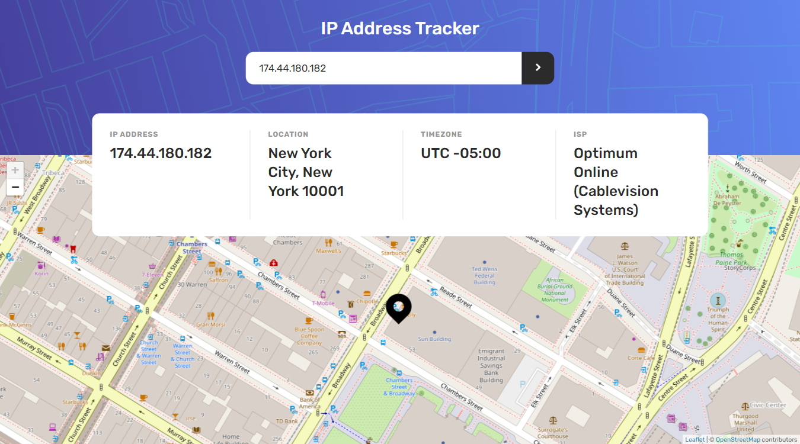
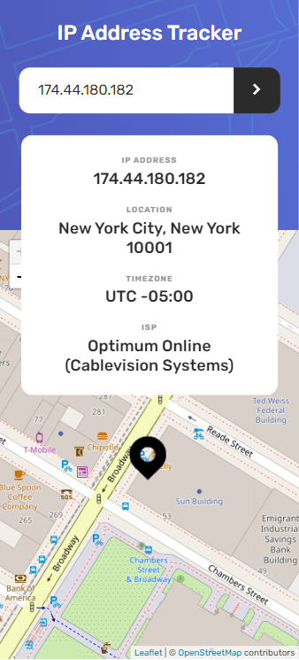

# 🎯 Frontend Mentor - IP Address Tracker Solution

This is a solution to the [IP address tracker challenge on Frontend Mentor](https://www.frontendmentor.io/challenges/ip-address-tracker-I8-0yYAH0). Frontend Mentor challenges help you improve your coding skills by building realistic projects.

## 📜 Table of contents

- [Overview](#overview)
  - [The challenge](#the-challenge)
  - [Screenshot](#screenshot)
  - [Links](#links)
- [My process](#my-process)
  - [Built with](#built-with)
  - [What I learned](#what-i-learned)
  - [Useful resources](#useful-resources)
- [Author](#author)

## 📝 Overview

### The challenge

- Your challenge is to build out this IP Address Tracker app and get it looking as close to the design as possible.
  - To get the IP Address locations, you'll be using the [IP Geolocation API by IPify](https://geo.ipify.org/).
  - To generate the map, we recommend using [LeafletJS](https://leafletjs.com/).

<br>

- Your users should be able to:
  - View the optimal layout for each page depending on their device's screen size
  - See hover states for all interactive elements on the page
  - See their own IP Address on the map on the initial page load
  - Search for any IP addresses or domains and see the key information and location

### Screenshot




### Links

- Solution URL: [Link](https://github.com/anushkachauhxn/frontend-mentor-projects/projects/8-ip-address-tracker)
- Live Site URL: [Link](https://anushkachauhxn.github.io/frontend-mentor-projects/projects/8-ip-address-tracker/)

## 💡 My process

### Built with

- Semantic HTML5 markup
- CSS custom properties
- Flexbox
- CSS Grid
- Vanilla JS
- [Leaflet JS](https://leafletjs.com/)

### What I learned

#### 😎 Proud of this JS:

```js
/* ------------ MAP DISPLAY ------------ */
const map_url = "https://{s}.tile.openstreetmap.org/{z}/{x}/{y}.png";

const map = L.map("map").setView([0, 0], 16);
const tiles = L.tileLayer(map_url, {
  attribution:
    '&copy; <a href="https://www.openstreetmap.org/copyright">OpenStreetMap</a> contributors',
});
tiles.addTo(map);

const icon = L.icon({
  iconUrl: "./assets/icon-location.svg",
  iconSize: [46, 56], // size of the icon
  iconAnchor: [23, 56], // point of the icon which will correspond to marker's location
});
const marker = L.marker([0, 0], { icon: icon });
marker.addTo(map);

function loadMapView(lat, lng) {
  map.setView([lat, lng], 16);
  marker.setLatLng([lat, lng]);
}
```

<br>

### Useful resources

- [Leaflet Quick Start Guide](https://leafletjs.com/examples/quick-start/)
- [Markers With Custom Icons](https://leafletjs.com/examples/custom-icons/)
- [IP Geolocation API Docs](https://geo.ipify.org/docs)
- [Using Fetch | MDN Web Docs](https://developer.mozilla.org/en-US/docs/Web/API/Fetch_API)

## ⭐ Author

- GitHub - [@anushkachauhxn](https://github.com/anushkachauhxn)
- Behance - [@anushka_creates](https://www.behance.net/anushka_creates)

- LinkedIn - [@anushka-chauhan](https://www.linkedin.com/in/anushka-chauhan)
- Twitter - [@anushka_creates](https://twitter.com/anushka_creates)
