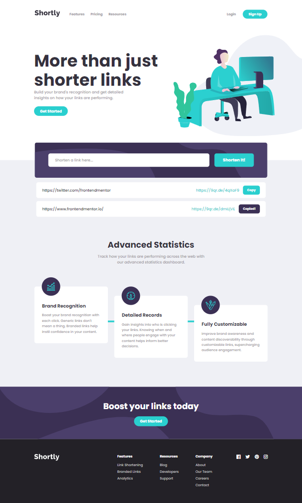

# 🎯 Frontend Mentor - Shortly URL Shortening API Challenge

This is a solution to the [Shortly URL shortening API Challenge challenge on Frontend Mentor](https://www.frontendmentor.io/challenges/url-shortening-api-landing-page-2ce3ob-G). Frontend Mentor challenges help you improve your coding skills by building realistic projects.

## 📜 Table of contents

- [Overview](#overview)
  - [The challenge](#the-challenge)
  - [Screenshot](#screenshot)
  - [Links](#links)
- [My process](#my-process)
  - [Built with](#built-with)
  - [What I learned](#what-i-learned)
- [Useful resources](#useful-resources)
- [Author](#author)

## 📝 Overview

### The challenge

- Your challenge is to build out this landing page, integrate with the [shrtcode API](https://app.shrtco.de/) and get it looking as close to the design as possible.

- Your users should be able to:
  - View the optimal layout for the site depending on their device's screen size
  - Shorten any valid URL
  - See a list of their shortened links, even after refreshing the browser
  - Copy the shortened link to their clipboard in a single click
  - Receive an error message when the `form` is submitted if:
    - The `input` field is empty

### Additional features I added:

- A loader shows up in submit button while API is fetched.
  - 
- Error Function for API errors
  - An alert shows up with 'Something went wrong' message.
- The user can submit their URL using the _Enter_ key if they don't want to click the shorten button.
- After the user has clicked the copy button, it changes to a dark colour with the words _Copied_. It changes back to the original state after 5 seconds, so that the user knows they can copy the URL again.

### Screenshot



### Links

- Solution URL: [Link](https://github.com/anushkachauhxn/frontend-mentor-projects/tree/main/projects/9-url-shortening-api)
- Live Site URL: [Link](https://anushkachauhxn.github.io/frontend-mentor-projects/projects/9-url-shortening-api/)

## 💡 My process

### Built with

- Semantic HTML5 markup
- CSS custom properties
- Flexbox
- Vanilla JS

### What I learned

#### 😎 Proud of this JS:

```js
/* -------- #1 SUBMIT BUTTON FUNCTION -------- */
submitBtnElement.onclick = function (e) {
  e.preventDefault();
  shortenUrl(inputElement.value);
};

/* Main Function */
function shortenUrl(inputUrl) {
  if (inputUrl === "") {
    addError();
  } else {
    removeError();
    showLoader();
    fetchData(inputUrl);
  }
}

/* API Function */
function fetchData(inputUrl) {
  fetch(`https://api.shrtco.de/v2/shorten?url=${inputUrl}`)
    .then((res) => res.json())
    .then((data) => {
      console.log("Success:", data);
      showResults(data.result.original_link, data.result.full_short_link2);
    })
    .catch((error) => {
      console.log("Error:", error);
      handleError();
    });
}

/* Show Function */
function showResults(inputUrl, outputUrl) {
  inputElement.value = "";
  resultsContainerElement.innerHTML =
    `<div class="result">
        <p class="long-link">${inputUrl}</p>
        <div>
            <p class="short-link">${outputUrl}</p>
            <button class="copy-btn">Copy</button>
        </div>
    </div>` + resultsContainerElement.innerHTML;

  hideLoader();

  // Call these functions each time to include the newly added html
  setTimeout(function () {
    copyBtns();
    populateStorage();
  }, 0);
}

/* -------- #2 COPY BUTTON FUNCTION -------- */
function copyBtns() {
  const resultElements = document.querySelectorAll(
    ".hero-component-results .result"
  );

  resultElements.forEach((result) => {
    const copyBtn = result.querySelector(".copy-btn"),
      copyText = result.querySelector(".short-link");

    copyBtn.onclick = () => {
      navigator.clipboard.writeText(copyText.innerText).then(() => {
        copyBtn.innerText = "Copied!";
        copyBtn.classList.add("active");

        setTimeout(() => {
          /* Set the copy button back to normal after 2 seconds */
          copyBtn.innerText = "Copy";
          copyBtn.classList.remove("active");
        }, 5000);
      });
    };
  });
}

/* -------- #3 RELOAD FUNCTIONALITY -------- */
function populateStorage() {
  sessionStorage.setItem("results", resultsContainerElement.innerHTML);
}
window.onload = () => {
  // Previous results stay on the page on refresh/reload
  resultsContainerElement.innerHTML = sessionStorage.getItem("results");
  copyBtns();
};
window.onunload = () => {
  // The page is clean when browser/tab is closed and then opened
  resultsContainerElement.innerHTML = "";
};
```

## 🔎 Useful resources

#### 💟 CSS Image Colour:

- [CSS filter generator to convert from black to target hex color](https://codepen.io/sosuke/pen/Pjoqqp)

#### 📙 API Documentation:

- [SHRTCODE API Documentation](https://shrtco.de/docs/)

#### ⚙️ Copy Button Functionality:

- [How to use Javascript to copy text to the clipboard | Clipboard API](https://dev.to/tqbit/how-to-use-javascript-to-copy-text-to-the-clipboard-2hi2)
- [How to get html element after append with pure JavaScript?](https://stackoverflow.com/a/47424032/12302691)

#### 🔃 To keep previous shortened links after refresh:

- [Web Local Storage](https://developer.mozilla.org/en-US/docs/Web/API/Web_Storage_API/Using_the_Web_Storage_API)
- [Session Storage](https://developer.mozilla.org/en-US/docs/Web/API/Window/sessionStorage)

#### 🧩 Other

- [How TO - Trigger Button Click on Enter](https://www.w3schools.com/howto/howto_js_trigger_button_enter.asp)

## ⭐ Author

- GitHub - [@anushkachauhxn](https://github.com/anushkachauhxn)
- Behance - [@anushka_creates](https://www.behance.net/anushka_creates)

- LinkedIn - [@anushka-chauhan](https://www.linkedin.com/in/anushka-chauhan)
- Twitter - [@anushka_creates](https://twitter.com/anushka_creates)
